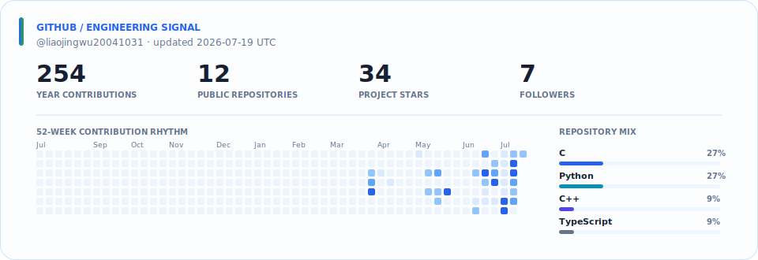

## 关于我

我是来自三峡大学计算机科学与技术专业的开发者，关注 **机器人系统、具身智能与 AI Agent 工程**。

我喜欢把跨层技术真正接通：从 **STM32 / CAN / 传感器驱动**，到 **ROS 2 / SLAM / Nav2 / 视觉感知**，再到 **多模态大模型、Agent 工具链、移动端与现场 UI**。目标不是停留在演示原型，而是做出能够联调、部署、比赛和持续迭代的完整系统。

> 把想法变成真正运行的系统——从嵌入式控制到智能 Agent。

## 工程重点

> **01 / 机器人与嵌入式系统** 
> ROS 2 · Nav2 · SLAM Toolbox · TF / EKF · LiDAR · ZED 2i · Jetson · CANopen · STM32

> **02 / 人工智能系统** 
> YOLO · OpenCV · TensorRT · 多模态 LLM · Qwen · AI Agent · 工具 / MCP 设计

> **03 / 产品工程与交付** 
> Python · C / C++ · TypeScript · Linux · Docker · GitHub Actions · 移动端 UI · Godot

## 代表项目

| 项目 | 工程亮点 |
| --- | --- |
| [🤖 智慧零售机器人](https://github.com/liaojingwu20041031/ylhb-smart-retail-robot) | ROS 2 + Jetson 的比赛级智慧零售机器人；打通 CAN 底盘、SLAM / Nav2、ZED 视觉、YOLO / TensorRT、多模态大模型、连续语音与现场 UI。 |
| [⚡ 电力巡检机器人](https://github.com/liaojingwu20041031/electric-power-inspection-robot) | 面向电力行业的智能巡检机器人，体现机器人系统集成、视觉感知与工程部署能力。 |
| [🏆 智能物流国银项目](https://github.com/liaojingwu20041031/GX-Intelligent-Logistics-Silver) | 2025 中国大学生工程实践与创新能力大赛国银开源项目；覆盖 STM32、机器视觉、路径规划与 PID 控制。 |
| [🧩 轻量 AI Agent 核心](https://github.com/liaojingwu20041031/mini-agent-core) | 轻量、可嵌入、兼容 OpenAI 接口的 AI Agent 核心库，具备模型服务适配、工具插件化与安全分级。 |
| [🌱 FloraMind 智能花盆](https://github.com/liaojingwu20041031/FloraMind) | 基于 STM32 + ESP32 的智能花盆，把嵌入式控制、联网能力与真实产品场景结合。 |
| [🥷 火影长篇创作 Skill](https://github.com/liaojingwu20041031/naruto-author-skill) | 面向长篇创作的工程化 AI Skill：资料库检索、时间线、剧情债、审核门禁与多阶段工作流。 |

## GitHub 数据

 

<strong>贡献轨迹</strong> · 根据 GitHub 贡献记录每日生成

  

### 认真构建，可靠交付，持续学习。

视觉组件：capsule-render · readme-typing-svg · skillicons · 仓库自生成 GitHub 数据面板 · Platane/snk

